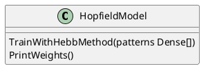

# Hopfield Model

En este repositorio se puede encontrar una implementación para el modelo 
de red neuronal de Hopfield en Go. Esta implementación entrena el modelo
usando el método de Hebb y muestra resultados favorables probando
el modelo con un 20% de ruido aleatorio.

## Estructura del proyecto

```
// Datos de entrenamiento
data/
-- centered.txt
-- uncentered.txt
// Contiene la implementación de la red Hopfield
models/
-- hopfield.go
// Funciones y utilidades para
// * Cargar matrices del sistema de archivos
// * Mostrarlas por pantallla
utils/
-- files.go
-- matrix.go
// Programa princial
main.go
```

## Implementación

El modelo se implementa mediante una estructura de datos `HopfieldModel`,
el cual se puede instanciar sin argumentos `NewHopfieldModel` y entrenar con el método `TrainWithHebbMethod`.
El número de nodos se deduce durante la fase de entrenamiento.
Cabe destacar que este modelo lee y retorna matrices NxM, es decir, imagenes
de N pixeles de alto por M píxeles de ancho, sin embargo, internamente realiza
las transformaciones necesarias para poder trabajar con vectores NM, es decir
matrices NMx1.



## Resultados

### Primer patron

Corresponde a una imagen con un círculo en el centro.

```
0 0 0 0 0 0 0 0 0 0 
0 0 0 0 0 0 0 0 0 0 
0 0 0 0 0 0 0 0 0 0 
0 0 0 0 1 1 0 0 0 0 
0 0 0 1 0 0 1 0 0 0 
0 0 0 1 0 0 1 0 0 0 
0 0 0 0 1 1 0 0 0 0 
0 0 0 0 0 0 0 0 0 0 
0 0 0 0 0 0 0 0 0 0 
0 0 0 0 0 0 0 0 0 0
```

Agregando 20% de ruido, la imagen se ve de la siguiente manera

```
0 0 0 0 0 0 1 0 1 0
0 0 0 0 0 0 0 0 0 0
0 0 0 0 0 0 0 0 0 0
0 1 0 0 1 0 0 1 0 0
0 0 0 1 0 0 1 0 0 0
0 0 0 0 0 1 1 0 0 0
0 0 0 0 1 1 0 0 0 0
1 0 0 0 0 0 0 0 0 0
0 0 0 0 0 0 0 0 1 0
0 0 0 0 0 0 0 0 0 0
```

Al hacer la pasada por el modelo, se obtiene la imagen esperada, el primer patron.

```
0 0 0 0 0 0 0 0 0 0
0 0 0 0 0 0 0 0 0 0
0 0 0 0 0 0 0 0 0 0
0 0 0 0 1 1 0 0 0 0
0 0 0 1 0 0 1 0 0 0
0 0 0 1 0 0 1 0 0 0
0 0 0 0 1 1 0 0 0 0
0 0 0 0 0 0 0 0 0 0
0 0 0 0 0 0 0 0 0 0
0 0 0 0 0 0 0 0 0 0
```
